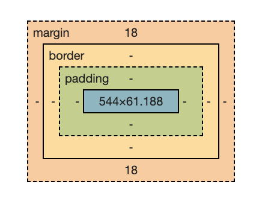

### 절대경로와 상대경로
- 절대 경로(/)
    루트 디렉토리(폴더) 기준으로 움직여요.
    - week1 폴더의 index를 지정하기 : **/week1/index.html**
    - week2 폴더의 father를 지정하기 : **/week1/father.html**
- 상대 경로(./)
    현재 위치를 기준으로 움직여요.
    - /week2/index.html에서 /week2/father.html 지정하기 : **./father.html**
- 상위 폴더(../)
    현재 위치의 상위 폴더로 움직여요.
    - week2/index.html에서 week1/index.html 지정하기 : **./../week1/index.html

## CSS
CSS란 Cascading Style Sheets의 철자로, HTML 등의 마크업 언어로 작성된 문서가 실제로 웹사이트에 표현되는 방법을 정해주는 스타일 시트 언어이다.

**HTML에 스타일을 표현하게 해주는 언어이다**
### 인라인 스타일
```html
<body>
    <h1 style="
        color: yellow;
        background-color: red;
    ">신짱구</h1>
</body>
```
인라인(inline) 스타일은 태그에 직접적으로 스타일을 입히는 방식이고, 태그에 **style**이라는 속성을 통하면 구현할 수 있다.
### 내부 스타일 방식
파일 내의 모든 h 태그에 한 번에 적용하고 싶을 때 사용한다.
```html
<style>
 h1, h2, h3, h4, h5, h6 {
 color: yellow;
 background-color: red;
 }
 </style>
```
head 태그 내부에 style 태그로 정의한다.

이처럼 내부(internal) 스타일은 HTML 문서 내부에 style 태그를 사용하여 스타일을 지정하는 방법으로 인라인 스타일보다는 우선순위가 낮다.
HTML 문서 내부의 태그들을 한번에 스타일을 지정해줄 수 있다.

**왜 head 태그 내부에 style 태그를 사용할까?**
    - head 태그 : 브라우저가 사용하는 정보
    - body 태그 : 사용자가 보는 정보

### 외부 스타일 방식
만약 페이지 수가 너무 많다면?

외부(external) 스타일은 HTML 문서와는 별개의 파일에서 스타일을 지정하는 방법이다. 스타일을 한 번에 작성해서 여러 HTML 문서에 적용할 수 있기 때문에 유지보수에 용이하다.

css파일을 만들어 style.css를 만들고 스타일링을 넣어준다. 이후에 **link 태그로 연결한다.**
index.html에 head 태그로 연결한다. head 태그 내에 link 태그를 통해 style.css 파일을 연결한다.
```html
<link rel="stylesheet" href="./style.css">
```
### CSS 문법
a { background-color:yellow; font-size: 16px;} 등으로 배경, 글자 크기 등을 바꿀 수 있다.

인라인 스타일은 최우선순위

### 의문 해결
**Cascading** 연쇄적인, 계단식, 위에서 아래로 떨어지는

**외부 스타일 < 내부 스타일 < 인라인 스타일** 의 우선순위가 있다.
Cascading은 여러 스타일 규칙이 적용될 때, 우선순위에 따라 스타일이 결정된다는 의미를 가진다.

**Sheet** 문서
StyleSheet는 CSS의 스타일 규칙들을 모아둔 파일이나 블록을 의미한다.
css 파일로 정의된 스타일 시트를 통해 heading 태그는 짱구 스타일링을 적용하기도 한다.

### 색상 정의
rgb(a,b,c)로 정의한다
이때 각 변수는 0~255까지 존재하며 차례대로 R,G,B 값을 갖고 있다.
- RED : #FF0000 or rgb(255,0,0)
- GREEN : #00FF00 or rgb(0,255,0)
- BLUE : #0000FF or rgb(0,0,255)

## Margin과 Padding
### Margin과 Padding의 차이
    **Margin**: Object와 화면과의 여백(외부여백)
    **Padding**: Object 내의 내부여백


- Margin은 Border 바깥쪽을 차지한다. 주변 요소와 거리를 두기 위한 영역이다.
- Padding은 Content와 Border 사이의 여백을 나타내는 영역이다. Content 영역이 배경색이나 배경 이미지를 가질 때, 이 Padding 영역까지도 영향을 미친다. 즉, Padding 영역도 Content의 연장으로 볼 수 있다.
- 음수값과 auto는 Margin만 적용 가능하다

### Margin과 Padding의 사용법
1. Margin 사용방법
- margin: 20px 같은 표현은 상하좌우 모두 20px을 의미합니다
- margin: 30px 10px은 상하 30px, 좌우 10px을 의미합니다.
- margin: 30px 10px 20px 50px은 위 30px, 오른쪽 10px, 아래 20px, 왼쪽 50px을 의미합니다.
- margin: 30px 10px 40px은 위 30px, 좌우 10px, 아래 40px을 의미합니다.
2. padding 속성 1개 사용
- 패딩의 1개 속성만 사용할 경우, 안쪽여백이 변경된다.
    - 예: padding: 20px
3. 단일 속성 부여
- 위, 오른쪽, 아래, 왼쪽 중 하나에만 값을 부여하고 싶은 경우, 하단과 같이 방향을 지정해주면 된다.
- 예: margin-right: 20px, padding-top: 10px
4. 가운데 정렬
- auto를 이용한다. **padding은 auto값 선언 불가.**
    - 예: margin: auto

**사용법**
    #box{ margin: 10px; padding: 20px }

*예시 코드*
```html
<html>
<head>
<style>
	.box-container{
		display: inline-block;
		background-color: #d2f4ff;
		border: 2px solid #09c;
		margin: 5px 15px;
	}
	.box-container div{
		width: 120px;
		height: 80px;
		background-color: #fde6ff;
		border: 2px solid #90C;
		font-size: 15px;
	}
	#box1{ margin: 10px;  padding: 0; }
	#box2{ margin: 5px 25px; padding: 0; }
	#box3{ margin: 0;  padding: 10px 30px 5px; }
	#box4{ margin: 10px; padding: 10px 20px; }
	#box5{ margin: 10px 30px 0 50px; padding: 30px 0 }
</style>
</head>

<body>
	<div class="box-container">
		<div id="box1">m: 10<br>p: 0</div>
	</div>
	<div class="box-container">
		<div id="box2">m: 5 25<br>p: 0</div>
	</div>
	<div class="box-container">
		<div id="box3">m: 0<br>p: 10 30 5</div>
	</div>
	<div class="box-container">
		<div id="box4">m: 10<br>p: 10 20</div>
	</div>
	<div class="box-container">
		<div id="box5">m: 10 30 0 50<br>p: 30 0</div>
	</div>
</body>
</html>
```
참고자료
<https://velog.io/@hyejin4169/CSS-margin-padding-%EC%B0%A8%EC%9D%B4%EC%A0%90%EA%B3%BC-%EC%82%AC%EC%9A%A9%EB%B2%95-%EC%A0%95%EB%A6%AC>
<https://ofcourse.kr/css-course/margin-padding-%EC%86%8D%EC%84%B1>
<https://aram5.tistory.com/10>


[Netlify 배포 사이트](https://66fa2fb71e32ddd351293034--transcendent-chaja-4c5dd5.netlify.app/)